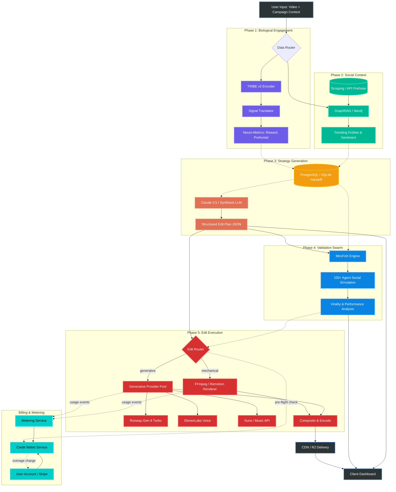

***

# Architecture Plan: Neuro-Social Content Engine

## 1. System Overview
This architecture processes video content through a dual-pipeline: extracting biological engagement metrics via neural encoding, and gathering real-time cultural context via a knowledge graph. These distinct data streams are synthesized by a frontier LLM to generate actionable editing suggestions, which are then stress-tested in a simulated multi-agent social environment. A final execution phase carries the suggested edits through to a rendered video, routing mechanical changes to a self-hosted compositor and generative changes to a pool of third-party model APIs (Runway, ElevenLabs, Suno, Veo). All third-party generative compute is metered and recovered through a credit-based billing system, so user charges scale with actual wholesale cost while preserving margin.

## 2. System Architecture Diagram

## 3. Component Breakdown & Data Flow

### Phase 1: Biological Engagement (The "Gut Reaction")
*   **Module:** TRIBE v2 (Meta AI).
*   **Function:** Processes the raw video file through a multi-modal encoder block (V-JEPA2, Wav2Vec-BERT, LLaMA 3.2).
*   **Data Transformation:** Converts 70,000 predicted fMRI voxels into structured JSON scores. A lightweight translator maps brain regions to marketing-friendly metrics (e.g., *Nucleus Accumbens* $\rightarrow$ `Reward_Potential: 0.85`).
*   **Resource Footprint:** Extremely High VRAM (28–32 GB). Must be flushed from GPU memory upon completion if running sequentially on local hardware.

### Phase 2: Social Context (The "Vibe Check")
*   **Module:** GraphRAG (Neo4j / NetworkX).
*   **Function:** Maintains a rolling 48-hour knowledge graph of current internet trends, memes, and news cycles. 
*   **Data Transformation:** Queries the graph against the video's metadata/transcript to pull relevant external context. For example, if the video is about a specific brand, it pulls the current public sentiment for that brand.
*   **Resource Footprint:** High System RAM (16–32 GB) to hold the entity relationship matrix. 

### Phase 3: Strategy Generation (The "Consultant")
*   **Module:** Claude (Anthropic API).
*   **Function:** Acts as the synthesizer. It takes the user's initial goals, the TRIBE neuro-score, and the GraphRAG cultural context to identify friction points.
*   **Output Format:** A structured **Edit Plan JSON** (not prose), so each suggested edit is independently routable in Phase 5. Each edit object specifies type (`trim`, `caption`, `b_roll`, `voice_replace`, `music_swap`, `style_transfer`), target timestamp, parameters, predicted lift, and provider hint.
*   **Example Prompt Structure:** 
    > *"The TRIBE data indicates the user's attention drops at 0:05 (low prefrontal activation). The GraphRAG data shows the topic is currently trending, but mostly in a sarcastic context. Suggest 3 specific edits to the pacing and script to align with current trends and maintain viewer retention. Return as Edit Plan JSON."*

### Phase 4: Validation Swarm (The "Digital Market")
*   **Module:** MiroFish (OASIS Engine).
*   **Function:** Simulates the actual release of the proposed content with an AB test.
*   **Execution:** Spawns a multi-agent swarm (e.g., 100 agents using a fast/cheap API like Groq or a local quantized LLM). The agents are initialized with biases derived from the GraphRAG trends and the TRIBE neuro-scores. They interact, comment, and share the "post," producing baseline metrics. Suggested edits from Phase 3 are then re-simulated to produce a delta forecast.
*   **Gating Role:** The simulation delta is what justifies firing a costly generative edit downstream. An edit with predicted uplift below a configurable threshold is dropped or marked optional, so users do not spend on Tier 3 generation that the model doesn't believe will move metrics.
*   **Output:** Generates a statistical breakdown of simulated performance, including projected sentiment polarity, shareability, and potential brand-risk flags, plus per-edit predicted lift used by the Edit Router.

### Phase 5: Edit Execution (The "Builder")
This phase converts the Edit Plan JSON into a rendered video, routing each edit to the cheapest provider that can fulfill it.

*   **Edit Router.** A stateless dispatcher that reads each edit object and selects a backend. Mechanical edits (trim, caption, overlay, format swap, audio level) route to the self-hosted compositor. Generative edits (B-roll synthesis, voice cloning, music generation, style transfer) route to the Generative Provider Pool. Before any edit fires, the router calls the Credit Wallet for a pre-flight balance check and reserves the estimated credit cost.
*   **Self-Hosted Compositor.** FFmpeg plus Remotion. Runs in the worker pool on CPU instances. Handles all Tier 1 edits at near-zero marginal cost. This is the default execution layer.
*   **Generative Provider Pool.** A thin abstraction over third-party model APIs:
    *   **Runway Gen-4 Turbo** for B-roll, transitions, style transfer (default visual generator).
    *   **Runway Gen-4** as a premium tier for higher-fidelity output when the user opts in.
    *   **ElevenLabs** for voice replacement, voice cloning, and TTS for new VO.
    *   **Suno or equivalent** for music generation.
    *   **Veo / Kling** as alternates for visual generation when Runway quotas are saturated or the use case fits better.
    *   The pool exposes one normalized interface so the rest of the system never knows which provider ran a given job.
*   **Final Composite & Encode.** All Tier 1 outputs and Tier 3 generated assets are stitched by FFmpeg into the final timeline, encoded for the target platform (TikTok, Reels, Shorts), and pushed to R2 storage with a CDN-fronted URL.
*   **Resource Footprint:** Compositor runs on commodity CPU. Generative calls are fully outsourced, so no local GPU is required for Phase 5. Render queue uses Temporal or BullMQ workers.

### Phase 6: Billing & Metering (Cost Recovery Layer)
The generative tier is expensive enough that subsidizing it across all users is not viable. This phase exists so that wholesale third-party costs flow through to the user as metered consumption with a margin markup.

*   **Credit Wallet Service.** Maintains a per-user balance denominated in **internal credits**, abstracted away from any specific provider's pricing unit. Users see one number rising and falling, not "Runway credits plus ElevenLabs characters plus Suno seconds."
*   **Metering Service.** Listens to job-completion events from the Compositor and Generative Pool. For every completed unit of work, it logs (a) the provider, (b) the wholesale cost in USD, (c) the equivalent credit charge to the user, and (d) the margin captured. This is the source of truth for both cost reconciliation with vendors and revenue recognition with users.
*   **Stripe Integration.** Two billable surfaces:
    1.  **Subscription tier billing** for monthly base plans, each of which includes a fixed credit allowance.
    2.  **Metered overage billing** for any consumption beyond the included allowance, charged at the end of the billing period or in batched increments to avoid per-edit transaction overhead.
*   **Pre-Flight Cost Estimation.** Before a generative edit fires, the router estimates its credit cost using known provider rates and reserves that amount in the wallet. If the user has insufficient credits and overage billing is disabled, the edit is blocked and the user is prompted to upgrade or top up. If overage is enabled, the job proceeds and the overage is added to the next invoice.

## 4. Subscription Tiers & Unit Economics

The pricing model is hybrid: a flat monthly subscription that includes a baseline credit pool, plus pay-as-you-go overage at a fixed rate per credit. The architecture treats "credit" as a unit of abstract compute that maps to a USD-denominated wholesale cost on the backend.

### 4.1 Credit Definition
1 credit = approximately $0.005 wholesale cost. Retail price to user: $0.01 per credit. This implies a **2x markup** on third-party generative compute, which is roughly the floor for sustainable margin once support, storage, egress, and orchestration overhead are factored in.

### 4.2 Provider Cost Mapping (illustrative)

| Operation | Wholesale cost | Credit charge to user |
|---|---|---|
| 1 sec mechanical render (FFmpeg) | ~$0.0001 | 1 credit |
| 1 sec caption / overlay | ~$0.0001 | 1 credit |
| 1 sec Runway Gen-4 Turbo B-roll | ~$0.06 | 25 credits |
| 1 sec Runway Gen-4 1080p B-roll | ~$0.12 | 50 credits |
| 1000 chars ElevenLabs voice | ~$0.20 | 60 credits |
| 30 sec Suno music generation | ~$0.10 | 40 credits |

These are reference numbers, not contractual. The Metering Service calculates actual charges per job from current vendor pricing pulled at job time, so margin is preserved if upstream pricing shifts.

### 4.3 Subscription Tiers (illustrative)

| Tier | Price / month | Included credits | Effective $/credit | Generative tier access |
|---|---|---|---|---|
| Free | $0 | Suggestions and simulation only | n/a | None (no execution) |
| Starter | $29 | 1,500 | $0.019 | Mechanical only (Tier 1) |
| Pro | $99 | 8,000 | $0.012 | Mechanical + capped Tier 3 |
| Studio | $299 | 30,000 | $0.010 | Mechanical + full Tier 3 |
| Overage (any tier) | n/a | n/a | $0.02 | Same as base tier |

A typical short-form Reel in the **execute-with-light-generation** path consumes roughly 200 to 600 credits. A heavy Tier 3 Reel consuming Gen-4 1080p plus voice plus music can hit 1,500 to 3,000 credits. The Pro tier is sized to comfortably handle 10 to 30 fully-executed videos per month for the typical creator.

### 4.4 Where the Margin Comes From
The 2x markup is structurally necessary. It absorbs:
*   Failed generations and retries (Runway and similar models have non-trivial failure rates).
*   Storage and CDN egress on rendered output.
*   The orchestration layer (queues, workers, Stripe fees, observability).
*   Phase 1 to 4 compute costs, which are otherwise unrecovered for users on the Free tier.

The architecture deliberately keeps suggestion-only and simulation-only access free, because Phases 1 to 4 produce Covalix's most differentiated signal. Charging starts at execution, where the cost is real and the willingness to pay is highest.

## 5. State Management & Handoffs
To ensure stability, especially if running models sequentially to manage VRAM constraints, direct memory-to-memory passing between heavy modules should be avoided.

*   **The Handoff Database:** Implement a lightweight local database (SQLite for development, PostgreSQL for production). 
*   **Execution Pattern:** 
    1. TRIBE finishes $\rightarrow$ Writes `neuro_metrics.json` to DB $\rightarrow$ VRAM is cleared.
    2. GraphRAG finishes $\rightarrow$ Writes `trend_context.json` to DB.
    3. An async orchestrator triggers the Claude API call only when both DB entries are flagged as `COMPLETE`.
    4. Claude's output (Edit Plan JSON) is written to the DB, which acts as the starting payload for the MiroFish simulation.
    5. MiroFish writes per-edit predicted lift back to the DB.
    6. The Edit Router reads the lift-annotated Edit Plan, performs a wallet pre-flight check, and dispatches each edit to its provider.
    7. Provider job results stream back through the Metering Service, which writes usage events and final composite pointers to the DB.

### 5.1 New Tables for Phases 5 and 6
*   `edit_jobs`: one row per edit object (status, provider, wholesale cost, credit charge, output URI).
*   `credit_wallets`: per-user credit balance, plan tier, overage opt-in flag.
*   `usage_events`: append-only log of every metered operation, used for invoicing and cost reconciliation.
*   `subscriptions`: Stripe subscription IDs, current period bounds, included credit allowance.

This separation means billing can be audited against vendor invoices independently of product behavior, which matters once usage scales and a single Runway API regression could otherwise compound silently into a margin loss.