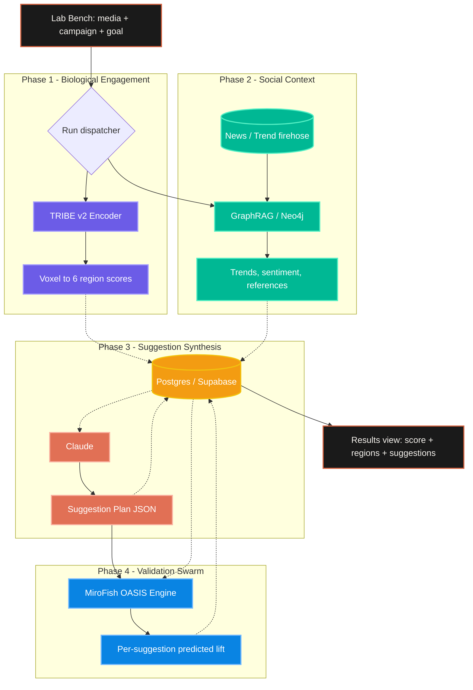

***

# Architecture Plan: Neuro-Social Content Audit Engine

## 1. System Overview

Cortyze takes ad creative (video, image, or carousel) plus a campaign brief and produces a single composite score, a six-region brain-activity breakdown, and a ranked list of actionable suggestions for improving the creative.

It does this by running two parallel pipelines:

1. **Biological engagement** — feed the media through a multimodal fMRI encoder (TRIBE v2) and reduce 70k predicted voxels to six brain regions that map cleanly to ad-effectiveness primitives (memory, emotion, attention, language, face recognition, reward).
2. **Social context** — query a rolling knowledge graph of recent web/cultural signal to ground recommendations in what's currently working in the wild.

Both streams write to a state DB and an async orchestrator hands the joined payload to Claude, which synthesizes a **Suggestion Plan**. That plan is then stress-tested in a multi-agent social simulation (MiroFish) which annotates each suggestion with a predicted lift in %.

The Cortyze frontend renders the entire result as a `Lab Bench → Analyzing → Results` flow. There is no editor, no rendering tier, and no billing tier in this build — Cortyze ships as a **pre-flight audit and recommendation product**.

> **Out of scope for this build.** Phase 5 (generative edit execution via Runway / ElevenLabs / Suno / FFmpeg compositor) and Phase 6 (credit-based PAYG billing) from earlier drafts of this document are removed. The product surface is `Score → Suggest`, not `Score → Suggest → Render`.

## 2. System Architecture Diagram



## 3. Component Breakdown & Data Flow

### Phase 1 — Biological Engagement
*   **Module:** TRIBE v2 (Meta AI), `facebook/tribev2` on HuggingFace.
*   **Function:** Multimodal encoder (V-JEPA2 + Wav2Vec-BERT + LLaMA 3.2) that predicts cortical fMRI activations from the input media.
*   **Reducer:** A pure-python step that maps 20,484 fsaverage5 vertices to 6 named regions and normalizes each to a 0–100 score. The 6 regions are fixed:

    | Key | Label | Source region |
    |---|---|---|
    | `memory` | Memory | Hippocampus |
    | `emotion` | Emotion | Amygdala |
    | `attention` | Attention | Visual cortex |
    | `language` | Language | Temporal lobe |
    | `face` | Face recognition | Fusiform face area |
    | `reward` | Reward | NAcc / VTA |

*   **Resource footprint:** 28–32 GB VRAM during inference. Must be evicted from GPU memory before Phase 4 runs if both share a card. In practice this runs on a remote GPU (RunPod) and the frontend never blocks on local hardware.
*   **Latency reality:** 3–12 minutes end-to-end for typical short-form video. The frontend's `Analyzing` view is a placeholder animation; production must show real progress (per-region completion events, see §5).

### Phase 2 — Social Context
*   **Module:** GraphRAG over Neo4j (or NetworkX for dev).
*   **Function:** Maintains a rolling 48-hour knowledge graph of trending entities, references, and sentiment. Queries are keyed off the user's brief / caption / detected media topics.
*   **Output:** Two things land in the state DB:
    1.  Sentiment + trend snapshot relevant to the campaign topic.
    2.  A short-list of 3–6 **reference campaigns** with comparable goal and recent performance — these are what the Suggestion view shows under "Reference" cards.
*   **Resource footprint:** 16–32 GB system RAM for the entity matrix. CPU-only.

### Phase 3 — Suggestion Synthesis
*   **Module:** Anthropic Claude (Sonnet 4.6 by default; the project supports Opus 4.7 for harder cases).
*   **Function:** Reads the joined payload (six region scores + their benchmark gaps + the GraphRAG trend context + the user's stated goal) and emits a structured **Suggestion Plan JSON** matching the exact shape the Results view consumes. No prose. No "thoughts" preamble.
*   **Output schema** (this is the contract — the frontend at `cortyze_frontend/lib/cortyze-data.ts` uses these field names verbatim):

    ```ts
    type SuggestionPlan = {
      score:     number;            // composite 0..100
      benchmark: number;            // category benchmark 0..100
      delta:     number;            // signed delta vs user's last run
      status:    "Needs work" | "Solid" | "Strong" | "Hero";
      regions:   {
        key:       "memory" | "emotion" | "attention"
                 | "language" | "face" | "reward";
        score:     number;          // 0..100
        benchmark: number;          // 0..100
      }[];
      suggestions: {
        id:          number;
        priority:    "critical" | "high" | "medium";
        title:       string;        // imperative, ≤ 50 chars
        area:        RegionKey;     // which region this targets
        lift:        number;        // expected % lift, e.g. 8.2
        explanation: string;        // 2-4 sentences, plain English
        reference:   {              // optional — null if no good match
          brand:    string;
          campaign: string;
          note:     string;
          scoreA:   number; labelA: string;  // e.g. 82, "Memory"
          scoreB:   number; labelB: string;  // e.g. 91, "Overall"
        } | null;
      }[];
    }
    ```

*   **Goal weighting.** The user's selected goal (one of `Brand recall`, `Purchase intent`, `Emotional resonance`, `Trust`, `Attention`) re-weights the 6 region scores into the composite. The composite is recomputed deterministically — Claude does **not** decide it. Claude only decides which suggestions to surface and ranks them.
*   **Prompt shape.** A short system prompt + the joined state DB record + a strict JSON output schema. Use prompt caching on the system prompt and the schema; cache hit rate should sit above 90% in steady state.
*   **Failure mode.** If Claude returns malformed JSON, retry with a tightened schema reminder; if it fails twice, surface a synthetic fallback plan generated from the region gaps alone (no trend context). The frontend always shows a Suggestion Plan; never an empty results page.

### Phase 4 — Validation Swarm
*   **Module:** MiroFish (OASIS engine) — see `cortyze/MiroFish`.
*   **Function:** Spawns ~100 lightweight agents seeded with biases derived from the GraphRAG sentiment snapshot and the TRIBE region gaps. Agents react to the original creative, then each suggested edit, producing a delta forecast.
*   **What it writes back.** For each `suggestion.id` in the Plan, MiroFish returns a `lift` value that overwrites the heuristic lift Claude proposed. This is the single number the user sees as "+8.2 expected lift" in the Results view.
*   **Gating:** Suggestions whose simulated lift falls below a configurable floor (default `1.5%`) are hidden from the surfaced list but kept in the DB for audit.
*   **Resource footprint:** ~100 short-lived agent threads × a fast LLM (Groq, Cerebras, or a local quantized model). Does **not** require the same GPU as Phase 1 — they run sequentially anyway, so a single network volume is fine.

## 4. State Management & Handoffs

Heavy modules never pass payloads in memory — every handoff goes through Postgres. This lets the GPU process exit between phases (freeing 30 GB VRAM) and lets the orchestrator be a thin async coordinator rather than a long-running monolith.

### 4.1 Tables

| Table | Purpose |
|---|---|
| `runs` | One row per user-initiated analysis. Holds inputs, status, timestamps. |
| `region_scores` | `(run_id, region_key, score, benchmark)` — six rows per run. |
| `composites` | `(run_id, score, benchmark, delta, status)` — one row per run, computed after region_scores land. |
| `trend_context` | `(run_id, payload_json)` — GraphRAG snapshot used by Claude. Kept for audit. |
| `suggestions` | `(run_id, ord, priority, title, area, lift, explanation, reference_json)`. Lift is updated in-place by Phase 4. |
| `past_runs_view` | Materialized view of `(run_id, name, kind, score, created_at)` for the sidebar. |

### 4.2 Execution sequence

1.  Frontend POSTs to `/runs` with the Lab Bench input. Backend writes a `runs` row in `status=queued`, returns `run_id`.
2.  Phase 1 picks up the job, runs TRIBE on RunPod, writes 6 `region_scores` rows, sets `status=neuro_done`.
3.  Phase 2 (running concurrently) writes `trend_context`, sets `status=context_done` if neuro already done, else `status=context_done_partial`.
4.  Once both flags are set, the orchestrator triggers Claude with the joined payload. Claude's output writes `composites` and `suggestions`. `status=plan_done`.
5.  MiroFish picks up `plan_done` runs, simulates each suggestion, updates `suggestions.lift`. `status=complete`.
6.  Frontend either polls `GET /runs/:id` or subscribes to a realtime channel. As soon as `status=complete` (or `plan_done`, if Phase 4 is slow), it transitions `analyzing → results`.

### 4.3 What this drops vs. the previous draft

* `edit_jobs`, `credit_wallets`, `usage_events`, `subscriptions` — all four tables and the entire Stripe metering layer are removed. Cortyze is not metering generative compute because Cortyze does not run generative compute.
* The "Edit Router" module is gone.
* Pricing tiers and the credit unit economics section are gone. If/when the audit product gets paywalled, it becomes a flat subscription (`Free` = read-only, `Pro` = full suggestion plan + history) — much simpler than the credit accounting the editor would have required.

## 5. Frontend Contract

The Cortyze frontend (`cortyze_frontend/`) consumes exactly four endpoints. Match the field names in `cortyze_frontend/lib/cortyze-data.ts` exactly — the components type-check against those names and any drift breaks the Results view silently.

### 5.1 Endpoints

| Method · Path | Body / Query | Returns |
|---|---|---|
| `POST /runs` | `{ name, goal, brief, caption, media_url }` | `{ run_id }` |
| `GET /runs/:id` | — | `{ status, result?: SuggestionPlan }` (see §3) |
| `GET /runs?limit=20` | — | `PastRun[]` for the sidebar |
| `GET /runs/:id/events` (SSE or WebSocket) | — | Stream of `{ stage, regionKey?, progress }` events for the Analyzing view |

### 5.2 Past run shape (sidebar)

```ts
type PastRun = {
  id:    string;            // "r-014"
  name:  string;            // campaign name
  date:  string;            // "Apr 28" — pre-formatted server-side
  kind:  "Video" | "Image";
  score: number;            // composite 0..100
};
```

### 5.3 Streaming progress (Analyzing view)

The current frontend animation is hard-coded to fake six 450ms region scans. Production should drive the same animation off real events:

```ts
// over SSE, server-sent events:
event: stage
data: { "stage": "neuro_scanning", "regionKey": "memory", "progress": 0.16 }

event: stage
data: { "stage": "neuro_scanning", "regionKey": "emotion", "progress": 0.33 }

// ...

event: stage
data: { "stage": "computing", "progress": 0.85 }

event: stage
data: { "stage": "complete", "progress": 1.0 }
```

`AnalysisAnimation` already accepts an `onComplete` callback and a sequential per-region activation pattern — wiring it to the SSE stream is a matter of replacing the `setTimeout` chain with an `EventSource` listener.

### 5.4 Auth

Auth is Supabase JWT. Every backend endpoint in §5.1 requires the `Authorization: Bearer <jwt>` header; `cortyze_frontend/lib/api.ts` (to be re-introduced) is the place to attach it. The `runs.user_id` column is the join key — users only ever see their own runs.

## 6. Open questions

These are intentionally not answered in this doc — they're product/cost calls, not architecture calls.

1.  **Where does the trend firehose come from?** Real-time scraping, NewsAPI, Reddit, X — each option has different cost/freshness/coverage trade-offs. Picking one is a follow-up.
2.  **Is the GraphRAG layer worth the operational cost on day one?** It's the heaviest non-GPU dependency. A simpler v1 would skip Phase 2 entirely and feed Claude only the brief + region scores; reference cards become optional. We can ship without it and add it back when we have signal that suggestions need cultural grounding.
3.  **MiroFish in v1 or v2?** Phase 4 is the slowest single phase per dollar. A v1 could ship with Claude-only lift estimates (no simulation) and add MiroFish once base usage justifies it. The frontend doesn't care which one writes the `lift` field.

These should be resolved before the first user-facing version goes out, so the suggestion quality bar is set deliberately rather than by what was easiest to wire up.
